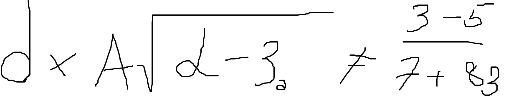
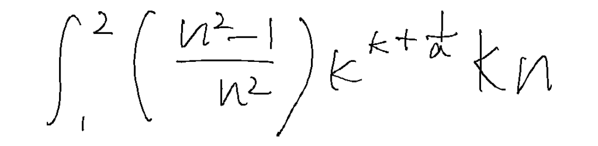

# Photomath

## Inspiration
This project is based on the data and motivation behind a 2012/13 held competition "[Crohme](https://www.isical.ac.in/~crohme/index.html)"


## Data
https://www.isical.ac.in/~crohme/CROHME_data.html

The [/utils](/utils) directory contains helpful scripts for manipulating ```.inkml``` files


## Model
This project uses pretrained [TrOCR model](https://huggingface.co/microsoft/trocr-large-handwritten), from [huggingface](https://github.com/huggingface/transformers)


## Project directories
```bash
.
├── LICENSE
├── Loss_data  # Loss data files
│   ├── loss_data_augmentv3.pkl
│   ├── symbol_loss_data.pkl
│   └── trocr_loss_data.pkl
├── Notebooks
│   ├── Symbol_class_trainbook.ipynb  
│   ├── Symbol_Segmentation.ipynb
│   └── transformer_trainbook.ipynb  # Main notebook for fine-tuning
├── README.md
└── utils  
    ├── classificator.py
    ├── converter.py  # Script for converting from MATHML to LATEX
    ├── inkml2img.py  # Converts .inkml files to images
    ├── inkml.py  # Class for representing inkml objects
    ├── pixelizer.py  # Script for assigning each pixel a symbol value
    ├── xsl_transpect  # Library for converting from MATHML to LATEX
    │   ├── ...
    └── xsl_yarosh
        ├── ...

```

## Results

$d\times A\sqrt{{\alpha}}-3\neq{7}^{3-83}$



$\int({n}^{2}-1{n}_{2}) {k}^{k+\frac{k}{n}}$



## Future work

Experiment with different models
